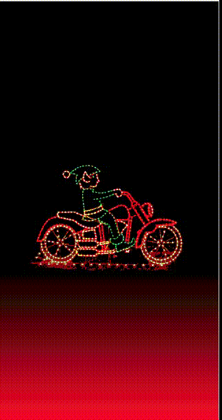

# Jquery Navideño JOJOJO

## Objetivos

El presente trabajo tiene como objetivo ser una guía en donde se pone en practica:

- Selección del DOM a través de la sintaxis de jQuery.

- Mostrar comprensión en el uso de eventos y selectores básicos de jQuery.

- Optimizar la validación de los inputs de un formulario a través de expresiones-regulares

- Utilizar localStorage para persintencia de data.

- Implementar las diferentes vistas de un app-web

## Flujo de la aplicación

## Desarrollado con:

`HTML5` `Jquery` `CSS3` `Bootstrap`

##  Créditos
* [Lourdes Vilchez] 